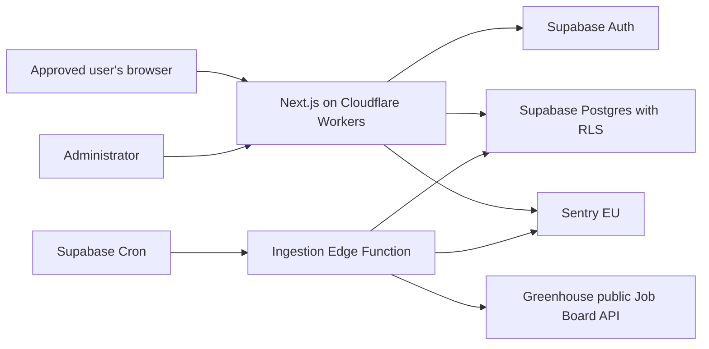

# JobWarden Foundation and UK Job Ingestion Design

**Date:** 17 July 2026
**Status:** Approved for implementation

## Product Summary

JobWarden is a private-beta, UK-only job-search command centre. It will collect vacancies from public employer career systems, normalise UK employment details, and help approved users find and track relevant work. It must cover permanent, fixed-term, temporary, contract, full-time, part-time, apprenticeship, internship, casual, and zero-hours work. Contract listings must represent inside-IR35, outside-IR35, not-applicable, and unknown states without guessing.

The first deliverable is a working vertical slice rather than a broad mock-up: one Greenhouse source adapter writes real UK vacancies to Supabase, and approved users can browse and filter those vacancies in a secure web application.

## Product Invariants

1. JobWarden contains UK jobs only. A remote vacancy is eligible only when the listing explicitly permits work from the UK.
2. Applications remain manual. JobWarden links users to the employer's application page and never submits an application.
3. Matching remains transparent and rule-based. No vector or opaque AI matching is part of this foundation.
4. The product is private beta. Creating an identity creates a pending access request, not application access.
5. Only an administrator can approve, reject, suspend, or restore access. The initial administrator is the project owner.
6. Job collection uses documented public endpoints or explicitly permitted pages. It never bypasses CAPTCHAs, access controls, paywalls, robots restrictions, or anti-bot systems.
7. Pricing, subscriptions, Stripe, Gmail, Calendar, AI writing, and auto-apply are outside this scaffold.
8. JobWarden has no pricing model. Payment providers, upgrade prompts, premium labels, plan entitlements, trials, quotas tied to plans, and billing settings must not be scaffolded or implied in the UI.

## Scope

### Included in the foundation

- A GitHub-ready TypeScript monorepo with a Next.js web application, shared domain contracts, Supabase configuration, tests, CI, and deployment configuration.
- A private landing page, Google sign-in, access-request flow, pending-access page, and server-side access guard.
- Administrator screens for access decisions, source configuration, and ingestion-run visibility.
- A filterable UK jobs feed and a job-detail page that links to the original employer page.
- A Greenhouse Job Board API adapter using read-only `GET` endpoints.
- UK eligibility, working pattern, employment type, salary/rate, and IR35 classification.
- Idempotent job upserts, ingestion audit records, stale-job handling, RLS, input validation, error reporting, and mutation audit logs.
- Persistent agent instructions and shipping standards inside the repository.

### Explicitly deferred

- Additional ATS adapters, employer-site discovery, generic DOM scraping, and Playwright.
- Workday integration or any Cloudflare/challenge solving.
- User-defined scoring rules, application CRM, interviews, CV variants, analytics reports, Gmail, Calendar, alerts, and exports.
- PostHog event capture until a compliant consent experience is enabled.
- Resend until passwordless email or job alerts are specified.
- Upstash, Pinecone, a separate FastAPI service, and a dedicated queue.
- Public registration and automatic access approval.

## Architecture

JobWarden uses a modular monolith so the initial product remains understandable while preserving boundaries that can become separate services later.



### Components

- `apps/web`: Next.js 16 App Router application deployed to Cloudflare Workers through OpenNext. Server Components perform reads, Server Actions perform authenticated mutations, and Route Handlers are reserved for callbacks or operational endpoints.
- `packages/domain`: Framework-independent Zod schemas, TypeScript types, UK classification rules, and application-state constants.
- `packages/ingestion`: Provider adapter interface, Greenhouse adapter, normalisation pipeline, idempotency rules, and fixtures. It contains no deployment-specific code.
- `supabase/functions/ingest-jobs`: A thin Edge Function wrapper that authenticates the scheduled invocation, acquires a source lock, runs adapters, and records results.
- `supabase/migrations`: Schema, constraints, indexes, RLS policies, database functions, cron configuration, and audit triggers.
- `docs`: Product vision, architecture decisions, shipping standards, source-compliance records, specifications, and implementation plans.

Cloudflare Workers hosts the web request path only. Job ingestion runs in Supabase Edge Functions, which avoids the Workers Free plan's low CPU allowance and keeps database scheduling near the data. A future browser-heavy adapter can be moved behind the existing ingestion interface into a Python or Node worker without changing the web application.

## Authentication and Private-Beta Access

Supabase Auth owns identity and sessions. Google OAuth is the first sign-in method. OAuth completion may create an `auth.users` identity, but it does not grant access to JobWarden data.

When Supabase creates an identity, a database trigger checks the private `app_settings.allow_access_requests` value. If requests are enabled, the trigger creates:

- a private `profiles` row;
- an `access_requests` row with status `pending`;
- an audit entry recording the request.

The access state machine is:

```text
pending -> approved -> suspended -> approved
pending -> rejected
rejected -> pending
```

Only an administrator may perform these transitions. Pending, rejected, and suspended users can read only their own profile and access status. They are redirected server-side to `/access/pending` and cannot query jobs through the Supabase API because RLS independently enforces the same rule.

Administrative access is stored in a non-user-editable `user_roles` table. The first administrator is created by a one-time local bootstrap command that looks up the owner's verified Supabase identity and writes the `admin` role using the service-role credential. The command also writes an audit record. No email address, request parameter, cookie value, public metadata field, or client-sent user ID can confer administrator rights.

The administrator can disable new requests by changing this database setting through an audited administrative action. When disabled, existing users can sign in, but new identities see a closed-beta message and no access request is created. The setting is not exposed to non-administrators for mutation.

## Routes and User States

- `/`: private-beta product explanation and sign-in entry point.
- `/auth/sign-in`: Google OAuth initiation and generic authentication errors.
- `/auth/callback`: PKCE callback validation and safe redirect.
- `/access/pending`: the user's current pending, rejected, or suspended state.
- `/jobs`: approved-user job feed with URL-backed filters.
- `/jobs/[jobId]`: normalised job details, source attribution, and manual application link.
- `/admin/access`: pending requests and access-state actions.
- `/admin/sources`: allowlisted Greenhouse sources and compliance metadata.
- `/admin/ingestion`: run history, per-source counts, durations, and sanitised failures.
- `/settings/account`: profile display, data export, and account-deletion request.

Every protected layout reads the verified server session and access state. Navigation visibility is a convenience only; route protection and RLS are the security boundaries.

## UI Direction

The supplied US-product screenshots are information-architecture references, not visual designs to copy. JobWarden adopts the functional strengths: persistent desktop navigation, a compact mobile drawer, a clear page title and status line, visible filters, compact summary counts, consistent job rows/cards, and a separated administrator area.

The foundation deliberately avoids the reference product's rougher patterns: mixed card and table layouts on one feed, excessive counts competing for attention, wide CRM tables before they are needed, multiple view-mode controls, premium-account labels, upgrade banners, AI-writing actions, and dense analytics without a decision attached. The first jobs feed uses one consistent responsive list. Its most prominent metadata is employer, UK location, workplace type, employment type, working time, compensation, IR35 status where relevant, posting age, and the original application link.

The visual language is restrained and functional: Geist typography, neutral surfaces, one blue action colour, semantic status colours used sparingly, keyboard-visible focus states, and designed loading, empty, error, pending-access, and no-results states. Desktop density must not compromise mobile usability or WCAG 2.2 AA contrast and interaction requirements.

## Data Model

### Identity and access

- `profiles`: `user_id`, display name, timestamps, and deletion state.
- `access_requests`: `user_id`, status, request/decision timestamps, decision reason visible to the user, and deciding administrator.
- `user_roles`: `user_id`, role (`admin` initially), creator, and timestamps.
- `app_settings`: singleton private-beta controls, including whether new access requests are accepted. Only administrators can read or mutate it.
- `audit_log`: actor, action, resource type, resource identifier, redacted metadata, and timestamp. Rows are append-only.

### Job collection

- `job_sources`: provider, board token, employer name, enabled state, minimum sync interval, last successful sync, terms/robots review dates, allowed method, and compliance notes.
- `jobs`: source, provider job ID, title, employer, sanitised description text, canonical application URL, country code, UK eligibility evidence, employment type, working time, workplace type, IR35 status, salary/rate fields, posting/closing timestamps, content hash, first/last-seen timestamps, and lifecycle status.
- `job_locations`: job, raw source location, normalised town/city, region, nation, postcode fragment when supplied, latitude/longitude only when obtained from an approved geocoder, and remote eligibility.
- `ingestion_runs`: trigger type, start/end timestamps, overall status, source/job counts, and a sanitised error summary.
- `ingestion_source_runs`: run, source, HTTP outcome, received/eligible/upserted/unchanged/closed counts, duration, and retry count.

The unique idempotency key for a listing is `(source_id, provider_job_id)`. A content hash prevents unchanged listings from creating writes or audit noise.

### UK employment vocabulary

- `employment_type`: `permanent`, `fixed_term`, `contract`, `temporary`, `apprenticeship`, `internship`, `casual`, `zero_hours`, `unknown`.
- `working_time`: `full_time`, `part_time`, `flexible`, `unknown`.
- `workplace_type`: `onsite`, `hybrid`, `remote`, `unknown`.
- `ir35_status`: `inside`, `outside`, `not_applicable`, `unknown`.
- `compensation_period`: `hour`, `day`, `week`, `month`, `year`, `unknown`.

Compensation stores raw text alongside parsed minimum, maximum, currency, and period. Currency defaults to GBP only when the source explicitly uses GBP or an unambiguous pound-denominated UK context. IR35 defaults to `unknown`; it is never inferred merely because a job is a contract.

## Row-Level Security

RLS is enabled on every exposed table.

| Data | Pending user | Approved user | Administrator | Ingestion service |
|---|---|---|---|---|
| Own profile/access state | Read own | Read own | Read all | No routine access |
| Jobs and locations | No access | Read active jobs | Read all | Insert/update |
| Sources and ingestion runs | No access | No access | Read/manage | Read/update assigned run |
| Roles | No access | No access | Read/manage | No routine access |
| Audit log | No access | No access | Read | Append only |

The browser never receives the Supabase service-role key. Administrative Server Actions use the caller's verified session and database policies or narrowly scoped `security definer` functions with explicit role checks. Every state mutation validates input and writes an audit entry in the same database transaction.

## Greenhouse Ingestion Flow

1. Supabase Cron invokes the Edge Function with a secret stored in Supabase Vault. An administrator can also request a run through an authenticated Server Action.
2. The function creates an `ingestion_runs` row and selects enabled sources whose minimum interval has elapsed.
3. A per-source Postgres advisory lock prevents overlapping runs.
4. The Greenhouse adapter issues an authenticated-free `GET /v1/boards/{token}/jobs?content=true` request with a timeout, a descriptive user agent, and capped retry/backoff for transient responses.
5. Zod validates the response before any field is trusted.
6. The normaliser converts HTML to sanitised plain text, validates application URLs against the expected HTTPS host, derives employment fields from explicit evidence, and records the evidence used.
7. The UK eligibility classifier accepts explicit UK locations and UK-qualified remote roles. It rejects non-UK roles and quarantines ambiguous locations rather than publishing them.
8. Eligible jobs are upserted by the provider key. Unchanged hashes update only `last_seen_at`.
9. A listing missing from one successful response remains active. It closes only after two consecutive successful source runs omit it, protecting against transient partial responses.
10. The function records counts and a sanitised outcome. A source failure does not close or delete any jobs.

The adapter implements read-only discovery. It does not use Greenhouse's application-submission endpoint.

## Source Safety and Legal Controls

Each source must be explicitly allowlisted. Its record documents the public endpoint used, terms and robots review dates, expected request cadence, and any restrictions. Initial ingestion uses Greenhouse's documented public Job Board API.

The system does not circumvent technical controls. A source that returns a challenge, denies access, changes its terms, or repeatedly rate-limits JobWarden is disabled for review. Workday and generic Playwright collection require separate source-specific specifications and legal review.

JobWarden stores only the content needed for private search and classification, attributes the employer/source, links to the canonical application page, honours removal requests, and removes closed content according to the retention policy. Before public or high-volume aggregation, the owner must obtain UK legal advice covering copyright, website terms, and database rights.

## Error Handling and Observability

- Every external request has an explicit timeout, at most two retries for transient failures, and exponential backoff with jitter.
- Adapter failures are isolated per source and return typed outcomes rather than throwing away the entire run.
- Users see distinct empty, loading, access-denied, source-unavailable, and unexpected-error states.
- Sentry uses its EU region with `sendDefaultPii` disabled. Events exclude access tokens, email addresses, job descriptions, raw source payloads, request bodies, and authorisation headers.
- Operational logs use correlation IDs and structured counts. They never contain secrets or full third-party responses.
- The administrator dashboard exposes the last successful run, current failures, and stale-source warnings so scheduled failures are not silent.

## Analytics and Email

PostHog is represented by a disabled analytics boundary, not an active browser SDK. When analytics is later enabled, PostHog EU loads only after affirmative consent and records a small event vocabulary with no job-description or profile content.

Resend is not installed in the foundation. When passwordless login or job alerts are specified, it will use a dedicated sending subdomain with SPF, DKIM, and DMARC, and the client will be initialised lazily at request time.

## Free-Tier Behaviour

- Supabase Free provides the initial database, authentication, Edge Functions, and scheduler. The administrator dashboard warns when the project has not run recently because free projects can pause after inactivity.
- Cloudflare Workers Free hosts the web app. The design keeps CPU-heavy ingestion off the request path and avoids assuming paid cache or queue features.
- PostHog and Sentry remain optional when credentials are absent; the application still builds and works without them.
- If an external quota is exhausted, ingestion records a visible degraded state and serves the last known jobs. It never silently deletes data or spins in an uncapped retry loop.

## Repository Structure

```text
.
├── AGENTS.md
├── CLAUDE.md
├── apps/
│   └── web/
├── packages/
│   ├── domain/
│   └── ingestion/
├── supabase/
│   ├── functions/ingest-jobs/
│   ├── migrations/
│   └── seed.sql
├── docs/
│   ├── architecture/decisions/
│   ├── product/
│   ├── standards/shipping-standards.md
│   └── superpowers/
│       ├── plans/
│       └── specs/
├── scripts/
├── .github/workflows/
└── package.json
```

`docs/standards/shipping-standards.md` is the canonical persistent copy of the supplied shipping standard. `AGENTS.md` and `CLAUDE.md` contain the product invariants and instruct every agent to read that standard before making changes. Architecture decisions record why Supabase Auth, Cloudflare Workers, rule-based matching, private approval, and the initial ingestion approach were chosen.

## Testing and Verification

### Unit tests

- Greenhouse response validation and mapping from checked-in fixtures.
- UK eligibility for England, Scotland, Wales, Northern Ireland, explicit UK remote, Europe-only remote, ambiguous remote, and non-UK locations.
- Employment type, working time, salary/rate, and explicit IR35 parsing, including false-positive cases.
- Content hashing, URL allowlisting, HTML sanitisation, and stale-job counters.
- Access-state transition rules and administrator checks.

### Database integration tests

- Migrations apply cleanly to local Supabase.
- Pending users cannot select jobs or invoke administrative functions.
- Approved users can read active jobs but cannot mutate them.
- Administrators can decide access and manage sources.
- Ingestion upserts are idempotent and audit rows are append-only.

### End-to-end tests

- A new Google-authenticated user lands on the pending page.
- The administrator approves that user and an audit entry is created.
- The approved user can open and filter the jobs feed.
- A suspended user loses access on their next server request.
- A real or recorded Greenhouse run produces only UK-eligible jobs and exposes its run status.

### Shipping verification

CI runs formatting, linting, strict type-checking, unit tests, database tests, a production build, dependency audit, and secret scanning. Deployment smoke tests verify the private landing page, access gate, approved jobs feed, and health endpoint on the real Cloudflare deployment.

## Success Criteria for the Scaffold

The scaffold is complete when a clean checkout can be configured from documented environment variables, migrations create the secured schema, the owner can bootstrap the administrator role, a second identity remains pending until approved, one allowlisted Greenhouse source can ingest UK jobs idempotently, approved users can filter those jobs, denied users cannot retrieve them directly, and all automated verification passes without requiring PostHog, Resend, Upstash, Pinecone, or pricing infrastructure.
